# Mini Avatar Customization System

A lightweight avatar customization system built in Unity3D.  
This was created as part of a hiring test submission for a studio in Kuala Lumpur.  

---

## Demo Playable


---

## 🎯 Features

- Swapable avatar parts (e.g. accessories, head, outfit, top, bottom, and shoes)
- Swapable avatar parts having mutual exclusivity for outfit and top/bottom/shoes as packed in the same category
- Simple UI to select and swap parts
- NPC population with random parts selection
- Extensible architecture to add new parts, categories, and features
- Easy to use and integrate into existing projects
note: Bitmask and enum combination for better scalability and performance

---

## ❓ Decisions & Assumptions

### Avatar Customization
- Basically this system having base mesh and part categories that can be managed to show/hide based on user customization.
- I chose to implement a simple system that allows users to swap out different parts of an avatar, such as accessories, head, outfit, top, bottom, and shoes.
- Using enum and bitmask combination and computation to manage parts and categories for better scalability and performance.
- Having list for each category to allow easy addition of new parts in the future.
- Each item in the list have two properties: the part itself (Skinned Mesh Renderer) and bitmask selection (enum) for hiding the base mesh when the part is selected.
- Add mutual exclusivity for the outfit category. This is mutually exclusive with the top, bottom, and shoes categories, meaning that selecting an outfit will deselect any top, bottom, or shoes that are currently selected, and vice versa.
- The system is designed to be easily extensible for adding new parts and categories in the future.
- The code is structured in a way that allows for easy addition of categories with minimal code changes, where new parts within the category can be added via the inspector.
- The UI is simple and straightforward, allowing users to easily select and swap out different parts of the avatar.
- The system is designed to be lightweight and efficient, ensuring that it runs smoothly even on lower-end devices.

### Spawn Manager (NPC Population)
- I assumed that the NPCs will be populated in the scene using a simple script that randomly selects parts from the available categories to create a unique avatar for each NPC.

### Player Movement and Animation
- I assumed that the player will be able to move around the scene using keyboard inputs, and the movement will be smooth and responsive.
- I assumed that the player will have basic animations for idle and walking/running, and the animations will transition smoothly based on the player's movement.

### Camera Controller
- I assumed that the camera will follow the player and provide basic third-person controls, allowing the user to rotate the camera around the player.

### Mouse Visibility
- I assumed that the mouse cursor will be hidden and locked to the center of the screen during gameplay, and will be visible and unlocked when interacting with the UI.

### User Interface (UI)
- I assumed that the UI will be simple and intuitive, allowing users to easily customize their avatar and spawn/despawn NPCs.

### Adding New Parts/Models
- for new parts/models, the parts should be properly rigged and weighted to the base mesh to ensure proper deformation during animations.
- for assigning new parts/models, the parts should be assigned to the correct category list in the AvatarCustomization script to ensure proper functionality (easy add by inspector).

### Adding New Categories
- for new categories, the enum and bitmask should be updated to include the new category.
- for adding new categories, the AvatarCustomization script should be updated to include the new category list and the necessary logic to handle the new category (minimal code changes). Also update the AvatarCustomizationUI script to include the new category buttons that easily add by inspector, logic will be handled by the script.


---

## 📁 Code Documentations

### NOTE: I used comments in the code for better understanding.
- [`AvatarCustomization.cs`](Mini-avatar-customization-system/Assets/KR/Scriptings/Avatar/AvatarCustomization.cs): This script manages the avatar customization system. It handles the selection and swapping of different parts of the avatar, as well as the mutual exclusivity between the outfit and top/bottom/shoes categories. It also provides methods for randomizing the avatar parts, used for NPC population as well. Note: include enums and structs.
- [`AvatarCustomDrawer.cs`](Mini-avatar-customization-system/Assets/KR/Scriptings/CustomEditor/AvatarCustomDrawer.cs): This script is a custom property drawer for the AvatarCustomization script. It provides a custom inspector interface for the avatar customization system, allowing users to easily select and swap out different parts of the avatar via buttons.
- [`PlayerMovement.cs`](Mini-avatar-customization-system/Assets/KR/Scriptings/Player/PlayerMovement.cs): This script handles the player movement. It allows the player to move around the scene using keyboard inputs. Note: using new Input System package for better scalability and performance, (implemented: Vector 2 Composite WASD keys).
- [`PlayerAnimation.cs`](Mini-avatar-customization-system/Assets/KR/Scriptings/Player/PlayerAnimation.cs): This script manages the player animations. It handles the transition between different animation states based on the player's movement, I use a single blend tree for idle and walk/run animations.
- [`CameraController.cs`](Mini-avatar-customization-system/Assets/KR/Scriptings/Camera/CameraController.cs): This script controls the camera movement. It allows the camera to follow the player and provides basic camera third person controls and rotating around the player. Note: using Cinemachine package for better scalability and performance. Implemented: Cinemachine FreeLook for third person camera controls with Orbital as Position Control and Rotation Composer as Rotation Control and InputAction to activate the camera rotation (Cinemachine Input Axis Controller) using mouse delta (By Holding Right Mouse Button)
- [`MouseVisibility.cs`](Mini-avatar-customization-system/Assets/KR/Scriptings/Misc/MouseVisibility.cs): This script manages the mouse visibility. It allows toggling the mouse cursor visibility and lock state, useful for switching between gameplay and UI interaction. Note: called in the `CameraController.cs` script when holding and releasing the right mouse button to toggle mouse visibility and lock state.
- [`SpawnManager.cs`](Mini-avatar-customization-system/Assets/KR/Scriptings/Manager/SpawnManager.cs): This script handles the spawning of NPCs in the scene. It randomly selects parts from the available categories to create a unique avatar for each NPC and spawns them at cached random positions around the player within a defined radius. note: using object pooling, initialize with initial spawn count and hide them all, accessible using UI to toggle visibility. It will enable if current amount is less than initial spawn count and create a new NPC instance from the pool when current amount exceed initial spawn count, Despawn will only hide the NPCs. Accessible via the inspector to set initial spawn count, max spawn count, spawn radius, and NPC prefab.
- [`AvatarCustomizationUI.cs`](Mini-avatar-customization-system/Assets/KR/Scriptings/UI/Avatar/AvatarCustomizationUI.cs): This script manages the avatar customization UI. It handles the button interactions for selecting and swapping out different parts of the avatar. It also provides a button to randomize the avatar parts, useful for NPC population as well.
- [`SpawnManagerUI.cs`](Mini-avatar-customization-system/Assets/KR/Scriptings/UI/SpawnManager/SpawnManagerUI.cs): This script manages the spawn manager UI. It handles the button interactions for spawning and despawning NPCs in the scene.

---

## 🔥 Rendering Optimization

### 🛠️SRP Batcher
Implemented on branch: [`performance_srp_batcher(passcall)`](https://github.com/krgameprogramming/Mini-avatar-customization-system/tree/performance_srp_batcher(passcall))
```
Unity Renderer
│
├── SetPass Calls  (Shader/Material switches)
│    - Expensive
│    - Each time Unity binds a new shader/material state to GPU
│    - Fewer is always better
│
├── Draw Calls  (Meshes submitted to GPU)
│    - "Draw this mesh with this state"
│    - One per object, unless batched or instanced
│    - More = heavier, but not as bad as SetPass
│
├── SRP Batcher
│    - Reduces CPU overhead for draw calls using the same shader
│    - Does NOT reduce the number of draw calls
│    - Instead, makes each draw call cheaper
│
└── GPU Instancing
     - Combines multiple identical meshes+materials into 1 draw call
     - Example: 100 trees → 1 instanced draw call
     - Does NOT work for SkinnedMeshRenderer (characters)
```
#### SRP Batcher Summary
Since GPU Instancing does not work for SkinnedMeshRenderer (characters), I implemented SRP Batcher with one same shader for all parts to reduce SetPass Calls and improve performance for CPU and GPU usage.


### 🛠️Mesh Combining (include SRP Batcher)
Implemented on branch: [`performance_mesh_combining(include SRP Batcher)`](https://github.com/krgameprogramming/Mini-avatar-customization-system/tree/performance_ssrp_batcher_AND_mesh_combine)
```
             ┌─────────────────────────┐
             │ Separated SkinnedMeshes │
             └─────────────────────────┘
                  │
                  │ Pros:
                  │ - High flexibility (enable/disable parts)
                  │ - Easier to manage multiple materials runtime
                  │ - Simple implementation
                  │
                  │ Cons:
                  │ - More draw calls (1 per part)
                  │ - Multiple skinning updates (1 per part)
                  │ - Medium CPU overhead (fixed by SRP Batcher)
                  ▼

             ┌─────────────────────────┐
             │   Combine/Recombine     │
             └─────────────────────────┘
                  │
                  │ Pros:
                  │ - Fewer draw calls (1 mesh)
                  │ - Lower SetPass Calls (using separated with SRP Batcher have same result, so not lower)
                  │ - Better for static or finalized characters
                  │
                  │ Cons:
                  │ - High recombine cost at runtime (if parts change often, so my assumption this is not suitable)
                  │ - Complex to implement for advanced models (bones, blendshapes)
                  │ - Low flexibility for customization
                  ▼
```
#### Mesh Combining Summary
I implemented mesh combining to reduce draw calls skin on GPU for better performance. Eventhough the result is great but it has high recombine cost at runtime if parts change often, so my assumption this is not suitable for this system. But I included it for reference.


---

## ⏳ What I learned and What I would like to try if I had more time

### 🛠️Try Mesh Combining Runtime
- I learned about the trade-offs between using separated skinned meshes versus combining/recombining them for avatar customization.
- Separated skinned meshes offer high flexibility and easier management of multiple materials at runtime, but they come with a performance cost due to increased draw calls and skinning updates.
- Combining meshes can reduce draw calls and improve performance, but it comes with its own set of challenges, such as high recombine costs at runtime and reduced flexibility for customization. But I would like to try to implement it if I had more time.

### 🛠️Try Texture Atlas
- I learned that using a texture atlas can help reduce the number of materials and draw calls, which can improve performance.
- By combining multiple textures into a single atlas, we can reduce the number of texture bindings required during rendering.
- This can be particularly beneficial for avatar customization systems, where multiple parts may use different textures.

### 🛠️(Most Wanted) Try Bake Skinned Mesh Renderer to Mesh Renderer -> VAT -> LOD
```
 [SkinnedMeshRenderer]           (Step 1 – Bake SkinnedMesh to Mesh Renderer)
        │
        │  Bake each animation frame (BakeMesh)
        ▼
 [Vertex Positions & Normals] 
        │
        │  Encode into
        ▼
 [Animation Textures]           (Step 2 – Shader: Vertex Animation Texture (VAT))
   (PositionTex, NormalTex)
        │
        │  Read by custom shader
        ▼
 [MeshRenderer + VAT Shader]    
        │
        │  (GPU Instancing works here)
        ▼
      [LODGroup]                (Step 3 – Add LODGroup for further optimization)
       /   |   \
      /    |    \
 [LOD0] [LOD1] [LOD2]
  High   Medium  Low
  Mesh    Mesh  Billboard
```

---


## 📷 Unity Profiler Results with Screenshots

###  📈Default without Optimization
#### Player (1 Character)
[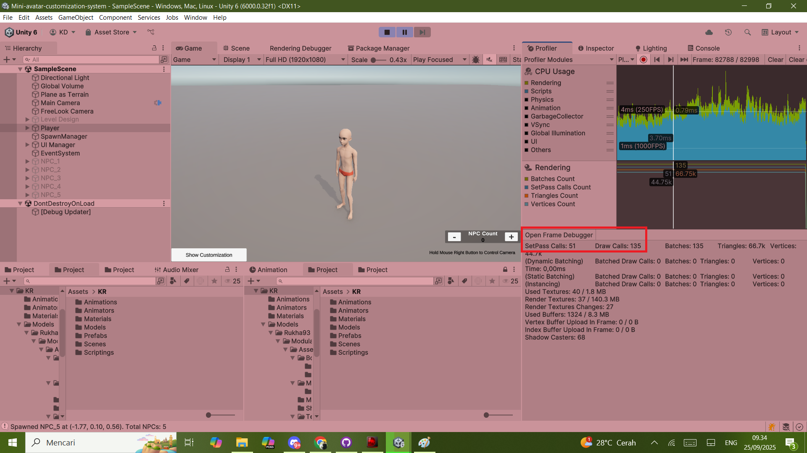](Documentation/Main_Player.png)
[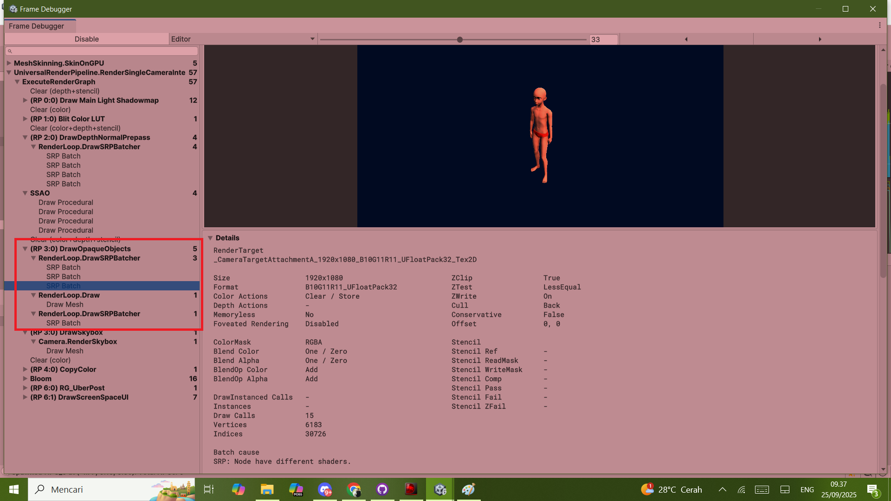](Documentation/Main_Player_FrameDebugger.png)
#### Player (1 Character) + NPCs (5 Characters)
[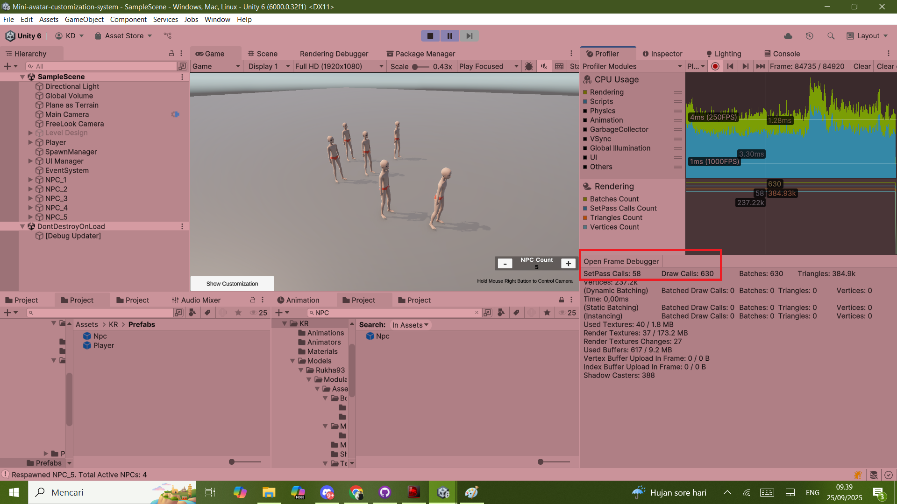](Documentation/Main_Player5NPC.png)
[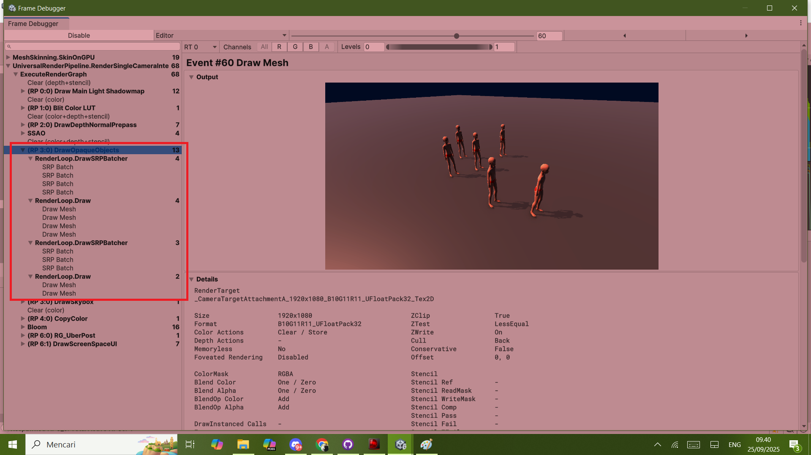](Documentation/Main_Player5NPC_FrameDebugger.png)

###  📈SRP Batcher (lower SetPass Calls)
#### Player (1 Character)
[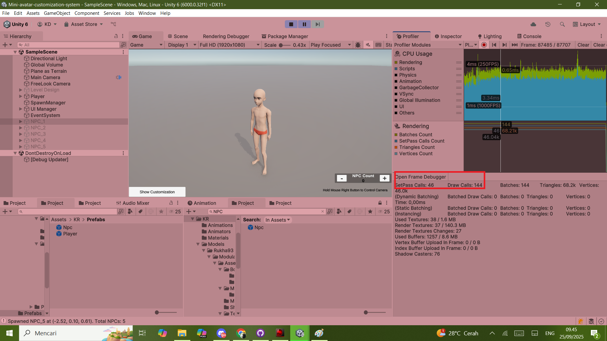](Documentation/Perform_SRPBatcher(passcall)_Player.png)
[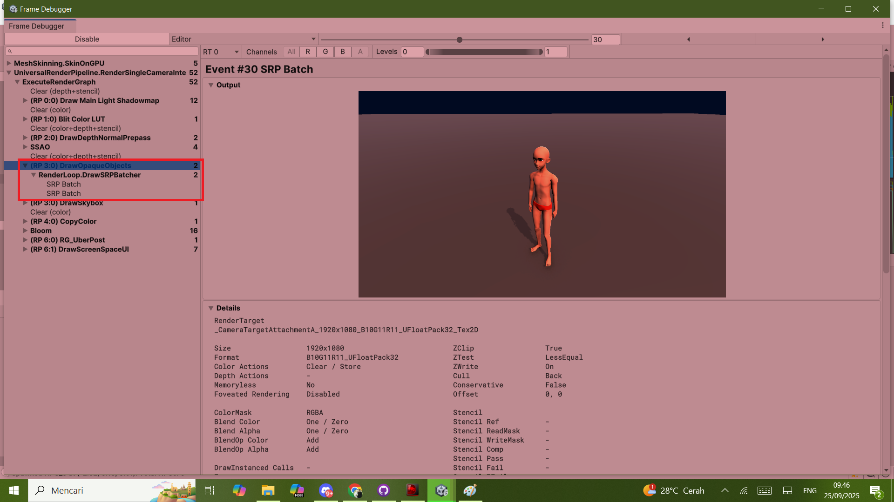](Documentation/Perform_SRPBatcher(passcall)_Player_FrameDebugger.png)
#### Player (1 Character) + NPCs (5 Characters)
[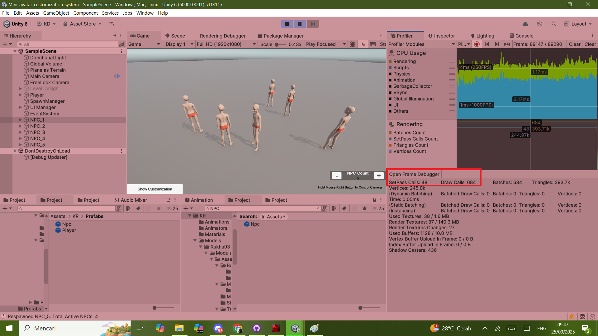](Documentation/Perform_SRPBatcher(passcall)_Player5NPC.png)
[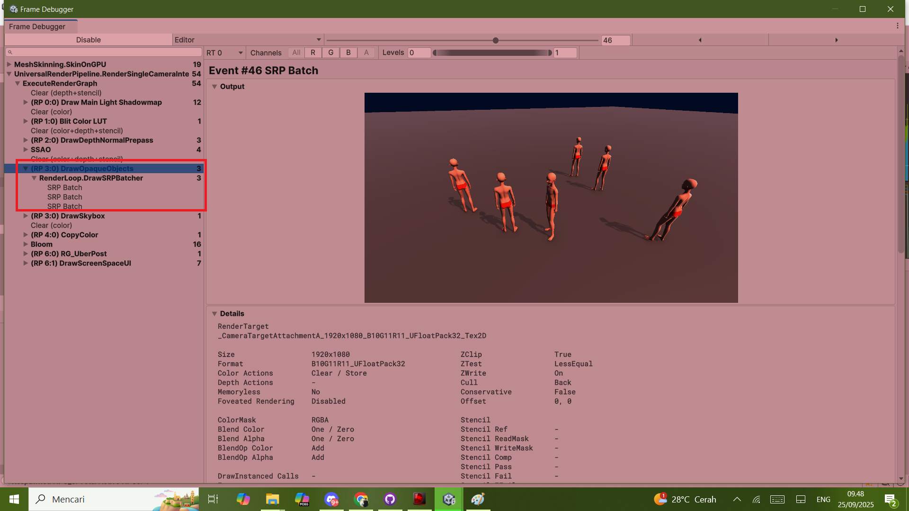](Documentation/Perform_SRPBatcher(passcall)_Player5NPC_FrameDebugger.png)
#### Player (1 Character) + NPCs (50 Characters)
[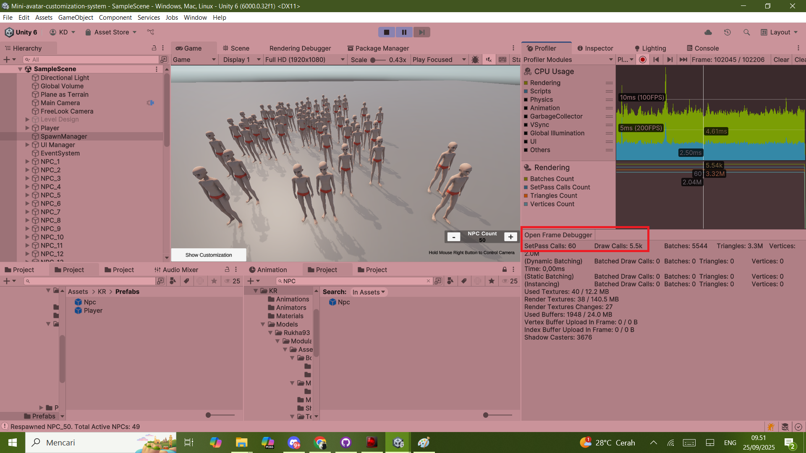](Documentation/Perform_SRPBatcher(passcall)_Player50NPC.png)
[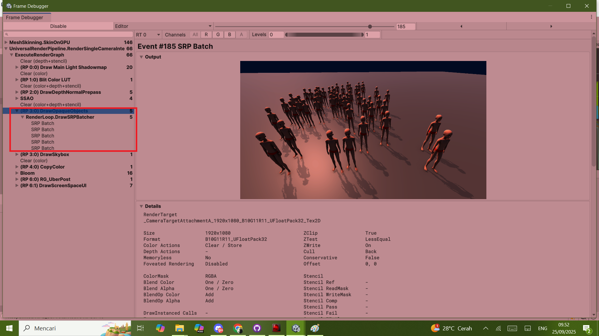](Documentation/Perform_SRPBatcher(passcall)_Player50NPC_FrameDebugger.png)
#### [`Summary`](#srp-batcher-summary)

###  📈Mesh Combining + SRP Batcher (lower Draw Calls Skin on GPU)
#### Before and After Mesh Combining
Creating combined mesh at start (before) and after (after) mesh combining. Destroy the original separated skinned meshes after combining.

[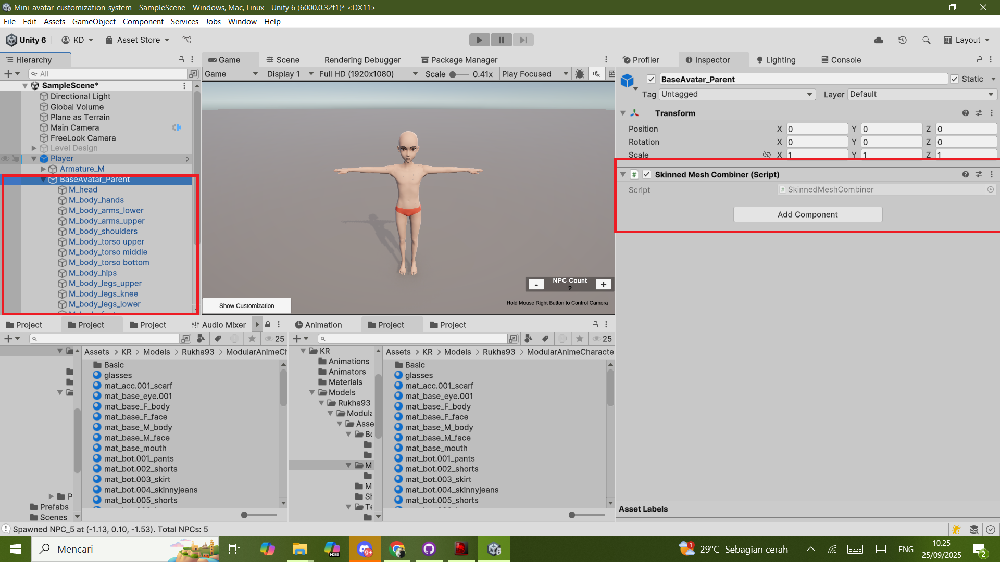](Documentation/Perform_MeshCombine_before.png)
[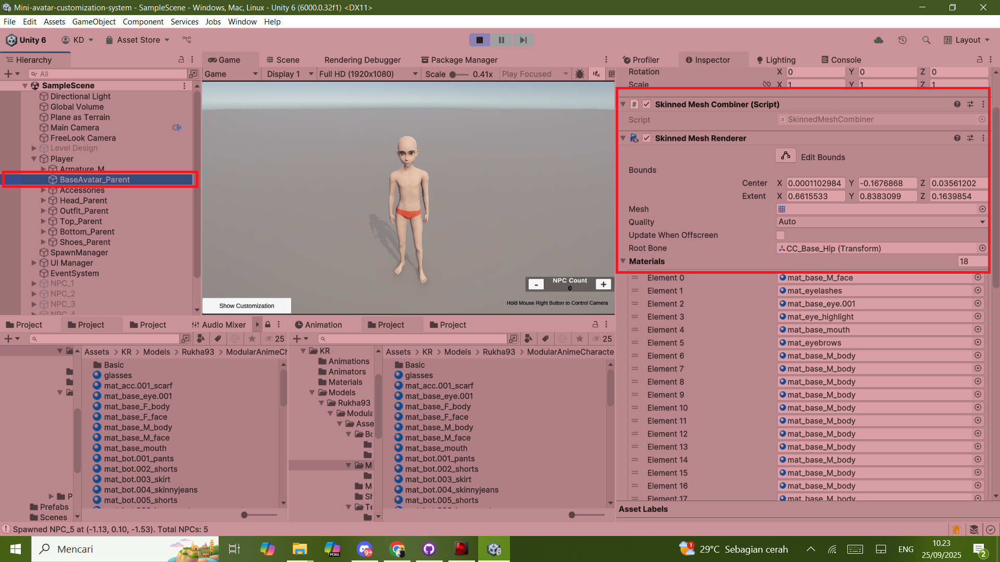](Documentation/Perform_MeshCombine_after.png)
#### Player (1 Character) + NPCs (5 Characters)
[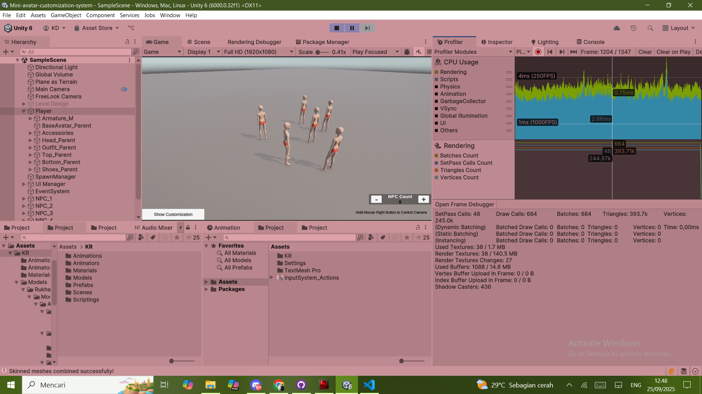](Documentation/Perform_MeshCombine_Player5NPC.png)
[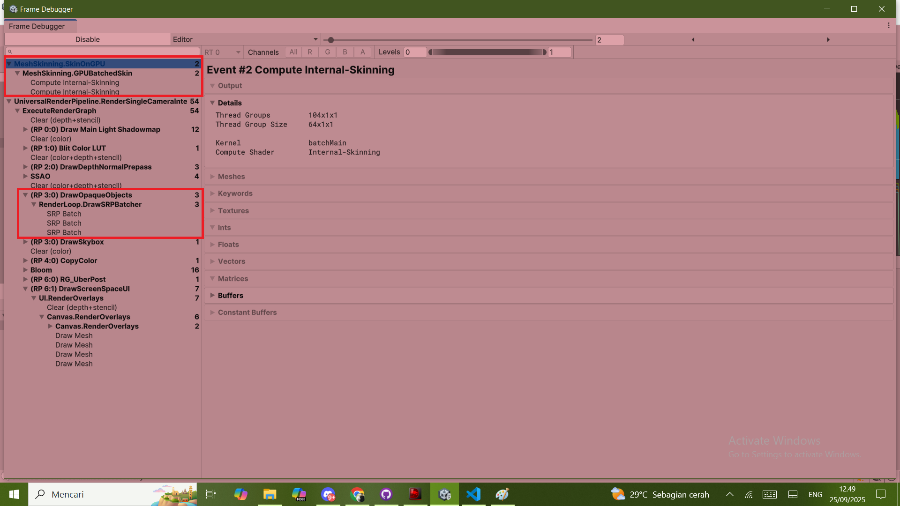](Documentation/Perform_MeshCombine_Player5NPC_FrameDebugger.png)
#### Player (1 Character) + NPCs (50 Characters)
[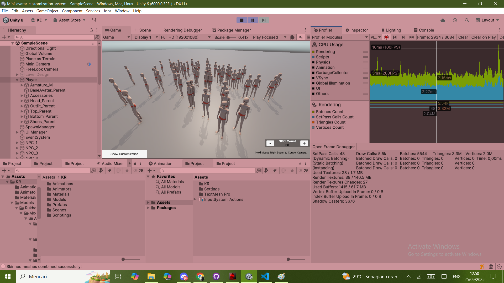](Documentation/Perform_MeshCombine_Player50NPC.png)
[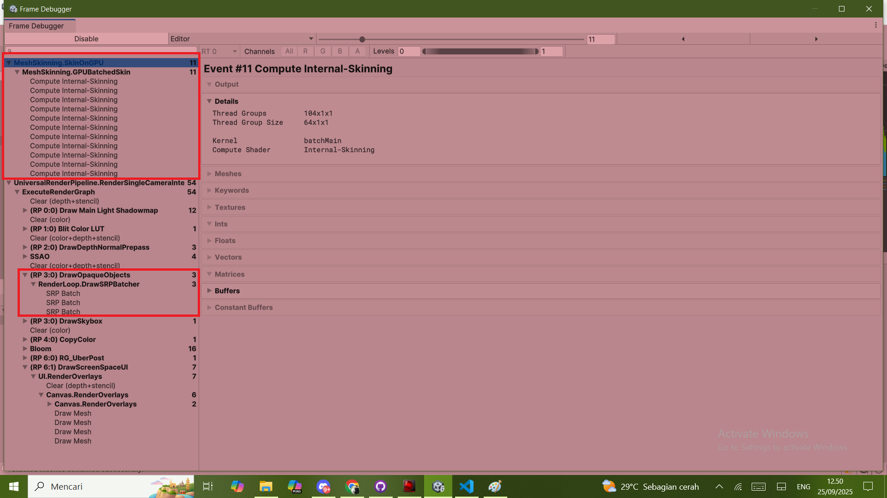](Documentation/Perform_MeshCombine_Player50NPC_FrameDebugger.png)
#### [`Summary`](#mesh-combining-summary)

---

## 📈 Answer to Bonus Question:
### 📈 Performance Improvements for Low-end Mobile Devices
Q: How would you profile and optimize this for low-end mobile devices?

A:
- First, Use Unity Profiler to identify performance bottlenecks, focusing on CPU and GPU usage, draw calls, and memory allocation.
- Implement SRP Batcher to reduce CPU overhead for draw calls using the same shader.
- Use Mesh Combining to reduce draw calls skin on GPU for better performance. (make the assumption that parts do not change often (on pause menu))
- Implement Level of Detail (LOD) to reduce the complexity of distant objects.
- Use occlusion culling to avoid rendering objects that are not visible to the camera.
- Optimize textures and materials by using compressed texture formats and reducing the number of materials used.
- Reduce the number of bones in the skinned mesh to improve skinning performance.
- Optimize animations by reducing the number of keyframes and using simpler animation curves.
- Low Poly models for the avatar and parts to reduce the number of vertices and triangles.
- Use baked lighting instead of real-time lighting to reduce the rendering load.
- Limit the number of NPCs spawned in the scene to reduce the overall rendering load.
- Test on actual low-end mobile devices to ensure performance improvements are effective.

### 📈 What Tools/Pipelines for Designers
Q: If you were building this as part of a larger system, what kind of tooling or pipelines would you create for designers?

A:
- For documentation, create a comprehensive documentation and guidelines for designers on how to create and rig avatar parts to ensure consistency and quality.
- For programming, create a modular and extensible codebase that allows for easy addition of new features and functionality in the future.
- For programming, create a custom editor window in Unity that allows designers to easily add, remove, and manage avatar parts and categories.
- For programming, using Unity's ScriptableObject to create data assets for avatar parts and categories, allowing designers to easily create and manage parts without modifying code.
- For programming, using Unity's Addressable Asset System to manage and load avatar parts and categories efficiently. And if patching is needed, it will be easier to manage.
- For programming, If really needed, using Unity's Entity Component System (ECS) for better performance and scalability, especially if the system needs to handle a large number of avatars and parts.
- For asset management, create a library of pre-made avatar parts that designers can use as a starting point for their designs.
- For version control, implement a version control system for avatar parts to track changes and allow designers to revert to previous versions if needed.
- For previewing, implement a preview system that allows designers to see how different parts look on the avatar in real-time.
- For testing, create a testing framework that allows designers to test their avatar parts in different scenarios and ensure they work correctly.
- For live operations, implement analytics to track user behavior and preferences regarding avatar customization, allowing for data-driven decisions on future updates and improvements.

---

## 🚀 Getting Started

### Prerequisites

- Unity version: (specify version you developed, mine Unity 6000.0.32f1 : LTS)  
- Minimum target platforms: for PC (Windows) at this time.

### Installation / Usage

Clone this repository:  
   ```bash
   git clone https://github.com/krgameprogramming/Mini-avatar-customization-system.git 
   ```

---

## 👤 Author & Acknowledgments

Author: Kas Raygaputra Ilaga aka KR (krgameprogramming)

This was specifically built as a second submission for a hiring test.

Thank you to reviewers / mentor(s) for the feedback.

---


## 📜 License

This project is licensed under the MIT License. See `LICENSE` for details.

---

## 📬 Contact

If you have questions, suggestions, or want to collaborate:

- GitHub: https://github.com/krgameprogramming (krgameprogramming)
- Gitlab: https://gitlab.com/krgameprogramming (krgameprogramming)
- Email: kasrayga.business@gmail.com
- LinkedIn: https://linkedin.com/in/kasraygaa (Kas Raygaputra Ilaga)
- Portfolio Showcase (on development): https://krgameprogramming.my.canva.site/ (Kas Rayga Showcase)

---